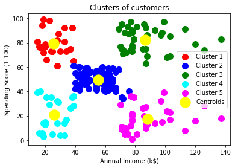
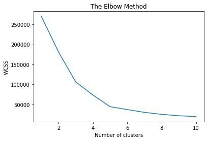
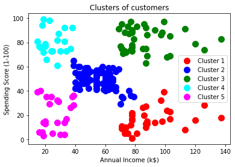
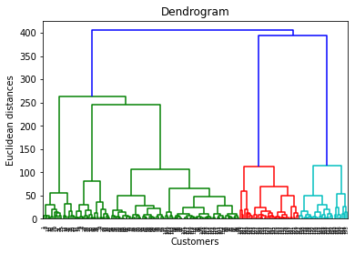

# &nbsp; Clustering Algorithms Repository &nbsp;  

Welcome to the Clustering Algorithms Repository! This repository contains implementations of popular clustering algorithms, specifically K-Means and Hierarchical Clustering, along with usage examples and explanations.

##  Table of Contents &nbsp; 

- [Introduction](#-introduction)
- [Algorithms](#--algorithms)
  - [K-Means Clustering](#--k-means-clustering)
  - [Hierarchical Clustering](#-hierarchical-clustering)
- [Usage](#usage-)
- [Contributing](#contributing-)
- [License](#license-)

##    Introduction 

Clustering is a fundamental technique in machine learning and data analysis, used to group similar data points together. This repository provides implementations and examples of two well-known clustering algorithms: K-Means and Hierarchical Clustering.

If you find this repository useful, consider giving it a :octocat:  :star: star  :star: :octocat: and following my GitHub account :eyes:. Your support motivates me to continue creating and sharing more open-source projects!

##  &nbsp; Algorithms

In this repository, both K-Means and Hierarchical Clustering algorithms have been implemented and provided with usage examples. Let's explore how these clustering techniques are used and some scenarios where they can be applied effectively:

**Scenarios for K-Means Clustering:**
- Customer Segmentation:
- Image Compression:
- Anomaly Detection:
- Document Classification:


**Scenarios for Hierarchical Clustering:**
- Biology: Classify species based on genetic similarities 
- Market Segmentation: 
- Image Analysis: 
- Social Network Analysis:
- 
By exploring and experimenting with the K-Means and Hierarchical Clustering implementations in this repository, you can gain valuable insights into how these methods can be applied to various real-world scenarios and datasets.

---
###   K-Means Clustering 
---

K-Means is an iterative algorithm that aims to partition a dataset into K distinct, non-overlapping clusters. It works by assigning each data point to the nearest cluster center and then recalculating the cluster centers based on the assigned points. This process continues until convergence.
K-Means Clustering is a versatile algorithm that is widely used for partitioning a dataset into a pre-defined number of clusters. In the repository, the K-Means implementation can be found in the [`k-means`](k-means.py) directory. It works as follows:

1. **Initialization**: K initial cluster centers are chosen, either randomly or using a heuristic method.

2. **Assignment**: Each data point is assigned to the nearest cluster center based on a distance metric (usually Euclidean distance).

3. **Update**: The cluster centers are re-calculated based on the mean of the data points in each cluster.

4. **Iteration**: Steps 2 and 3 are repeated iteratively until convergence or a predetermined number of iterations.

5. **Output Visualization :** Img 1 illustrates scatter points of clusters and Img2 illustraes Elbow method implementation.

   
 &nbsp;&nbsp;&nbsp;&nbsp; 

---
###  Hierarchical Clustering
---
Hierarchical Clustering is a technique that builds a hierarchy of clusters by either merging smaller clusters into larger ones (agglomerative) or dividing larger clusters into smaller ones (divisive). It creates a tree-like structure called a dendrogram, which can be used to visualize the clustering process.Hierarchical Clustering is a method for creating a hierarchy of clusters that can be represented as a dendrogram. In the repository, the Hierarchical Clustering implementation can be found in the [`hierarchical`](hierarchical-clustering.py) directory. It operates as follows:

1. **Agglomerative or Divisive**: Hierarchical Clustering can be either agglomerative (bottom-up) or divisive (top-down). In the agglomerative approach, each data point starts as its own cluster and is successively merged with other clusters. In the divisive approach, all data points begin in one cluster and are recursively divided.

2. **Linkage Criteria**: The linkage criteria determine how the distance between clusters is measured. Common linkage criteria include single linkage (nearest neighbor), complete linkage (furthest neighbor), and average linkage.

3. **Dendrogram Construction**: As the algorithm progresses, a dendrogram is built, showing the hierarchical relationships between clusters.

4.  **Output Visualization :** Img 1 illustrates scatter points of clusters and Img2 illustraes Dendrogram method implementation.

 &nbsp;&nbsp;&nbsp;&nbsp; 

## Usage 

To use the clustering algorithms provided in this repository, follow these steps:

1. Clone the repository to your local machine:
   ```bash
   git clone https://github.com/arshpreet8051/Clustering.git

## Contributing 
Contributions, suggestions, and feedback are welcome! If you would like to contribute to this repository, please follow the guidelines outlined in the [CONTRIBUTING.md](CONTRIBUTING.md) file.

## License [](LICENSE)
This project is licensed under the MIT License. See the [LICENSE](LICENSE) file for details.
